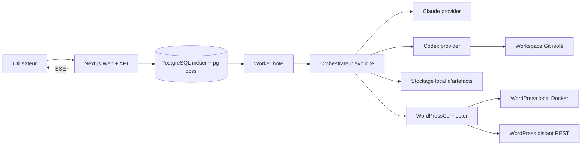
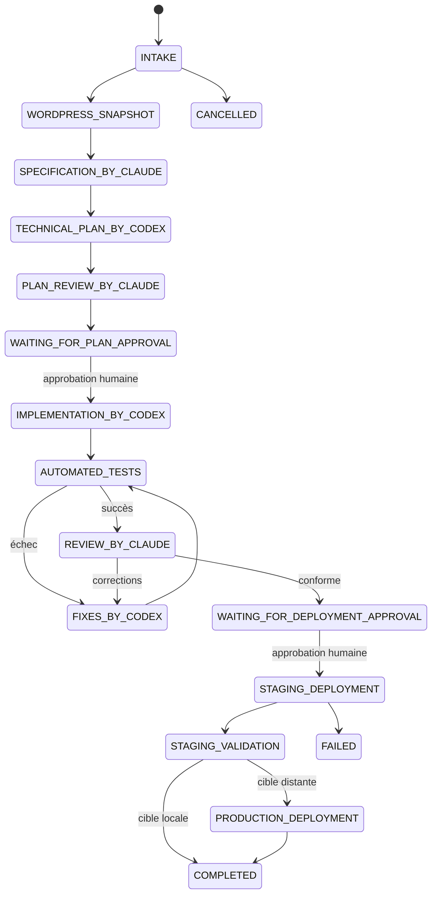

# Architecture

Le web ne reçoit jamais un secret déchiffré. Le worker charge les secrets seulement au moment de l’opération WordPress. Claude reçoit le brief et les rapports utiles ; Codex reçoit la spécification et travaille dans un répertoire dédié. Les contenus distants sont placés dans une section non fiable du contexte.

Chaque transition vérifie une version optimiste, écrit un `AuditLog` et accepte un rejeu idempotent vers le même état. pg-boss utilise un schéma PostgreSQL séparé, des retries exponentiels, un heartbeat et une clé singleton par run. `JobLock` garantit en plus une seule mutation active par projet et expire automatiquement.
